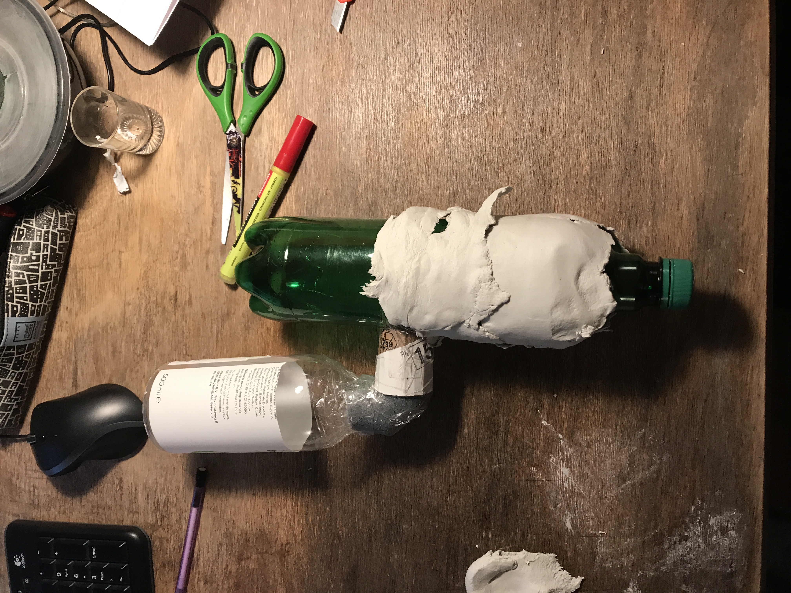
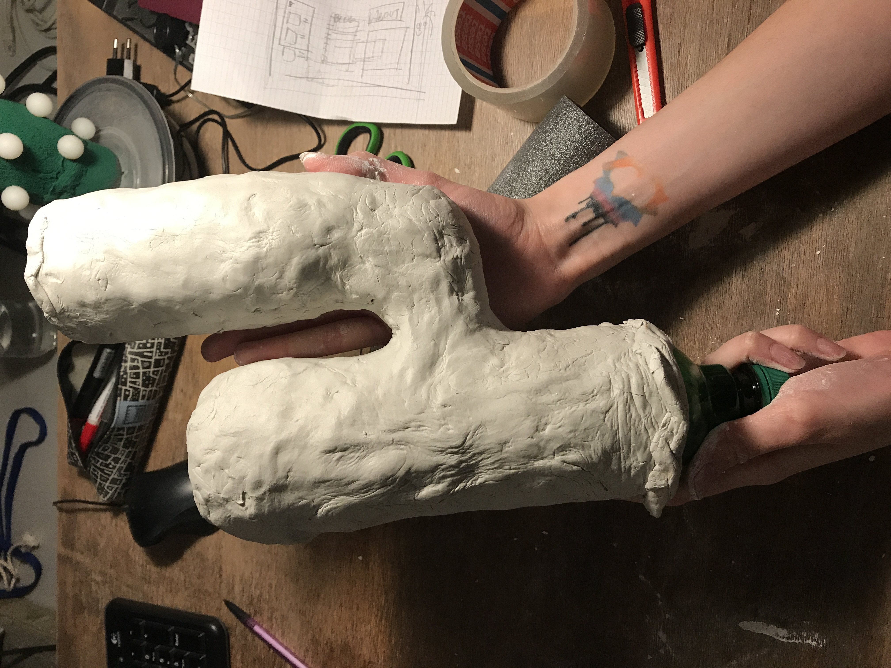
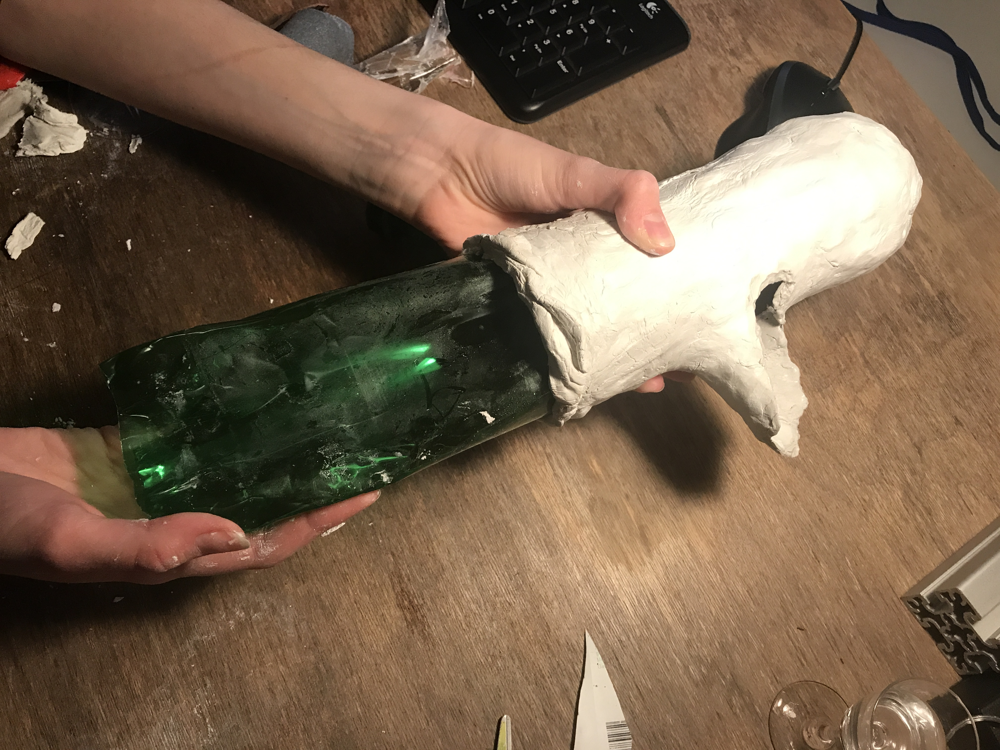
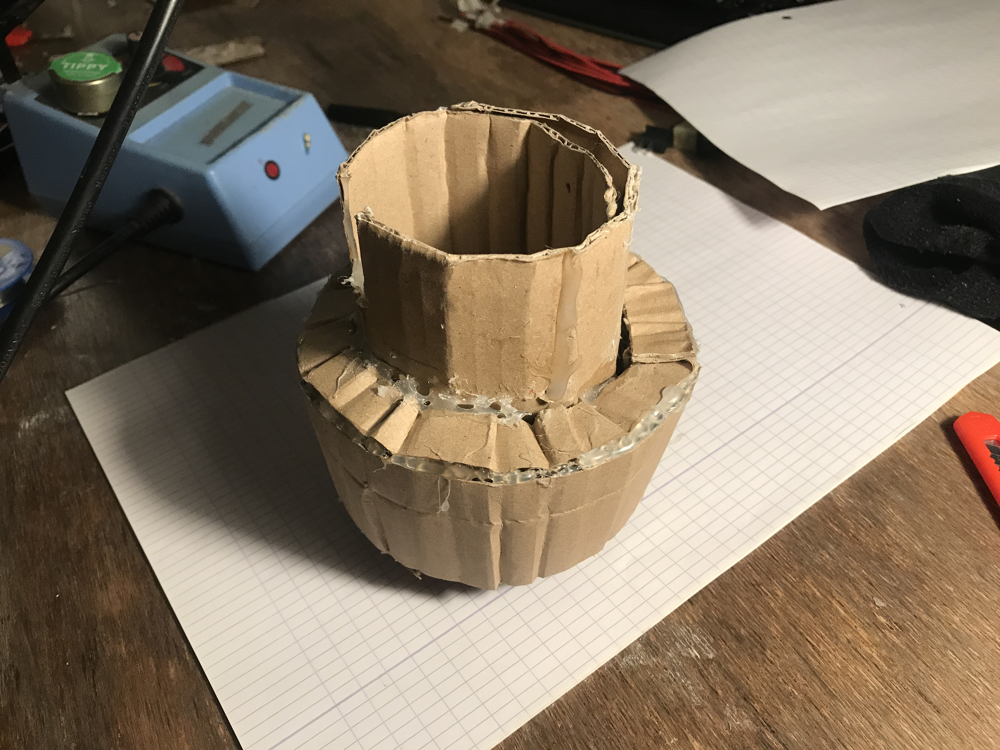
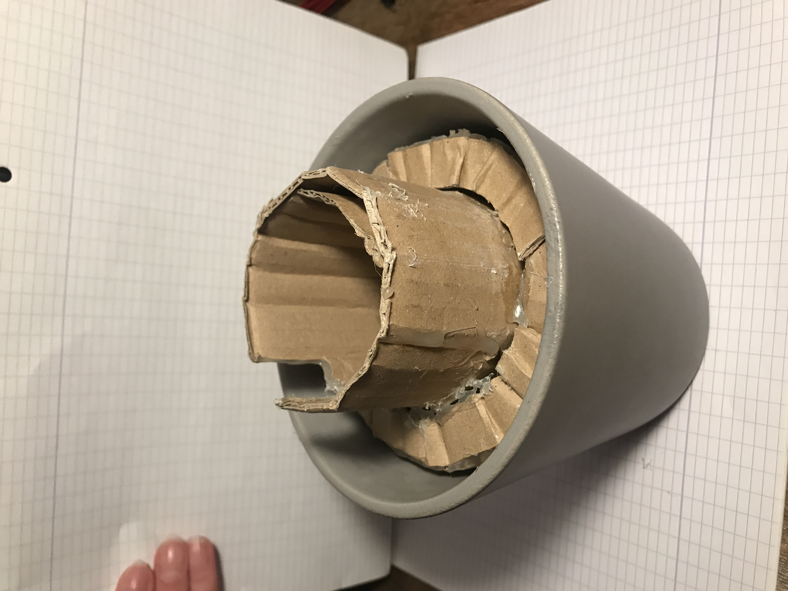
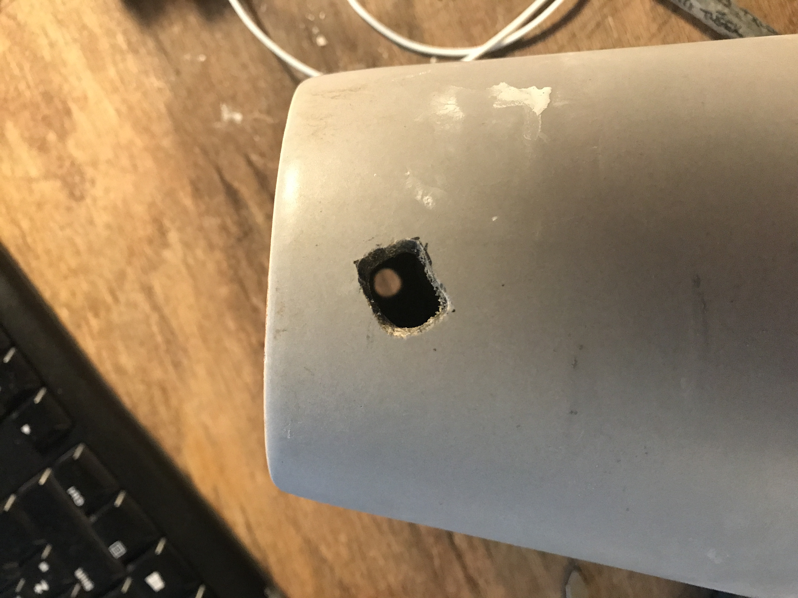
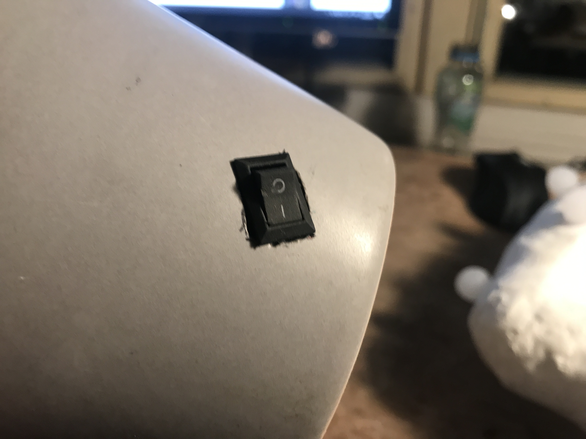
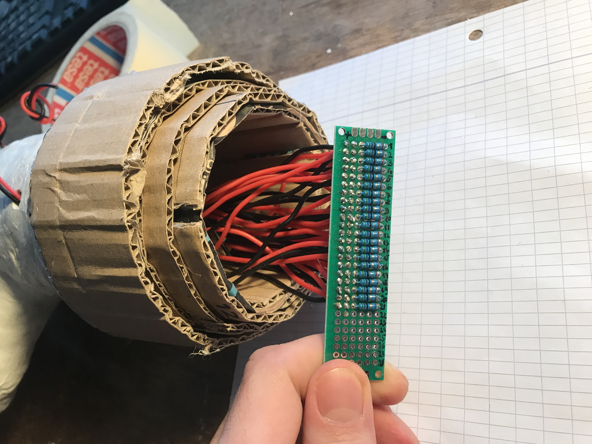

How to make a better version of the cactus? Honestly, I'm afraid to even touch the first one: it flips over easily, diffuser caps fall out sometimes and half of the lights don't work anyways. Improving on this shouldn't be too hard.

## Sculpting

This time we used a **modeling clay** and went for a fancier shape of the cactus. It wasn't obvious how and where to start, so we took the "just do it and pray" approach. Two plastic bottles were connected together using random stuff (cardboard, piping foam leftovers, lots of tape) and covered with the modeling clay.

    
    

It looked pretty well and robust enough, but there was an issue: how to get the bottles out? Oh, by the way, the bottle was previously used for a home-made schnaps, so the whole thing smelled like booze. A lot.

We detached the "arm" of the cactus by somehow cutting it off and pulled the main bottle out. Same thing for the smaller bottle and the joint between the two. Somehow. Not without damage though, but nothing that couldn't be fixed with more clay :)

{: class="wider"}

In order to make it more robust, we used an actual **flower pot** and hacked together a cardboard mount for the cactus.  

Drilling a hole into the pot was a real pain in the ass, but we wanted to mount a switch properly. It took a loong time and a drill-bit was getting really hot, but in the end it worked out and it looks pretty cool. 

    
    

    
    

## Electronics

NO DUCT TAPE THIS TIME!!! The previous cactus was powered by an USB charger which "worked" but didn't look nice and the cable was too short. All of its wires were "protected" by a regular tape, some of the LEDs were connected in series and half of them didn't work. 

This time I've put some more love into the wiring:

- using a perfboard (all connections + resistors)
- using a proper power supply [^1]
- using a on/off switch
- using heat-shrink tubes [^2]

{: class="wider"}

Wiring and soldering everything together took about 6 hours. The most annoying and time-consuming task was getting the wires through the cactus (small hole IN, bottom opening OUT). Is there a smart way to do this? Anyways, **all of the LEDs work**! No accidental blinking!

Finally we connected an on/off switch to the board. Drilling into the flower pot was tricky and took a long time. We used a stone drill-bit and lots of patience. There was smoke, so we cooled it down using water.

[^1]: 220V, X A. Opened it just enough to reach the power rails, otherwise left untouched and inside enclosure.
[^2]: 22 awg, stranded silicone wire

## Das-mas cactus v2 results

That was it, it turned out pretty well I think. Look at the photos :)

IMAGE OF VITA WITH THE CACTUS,
IMAGE OF CACTUS CLOSEUPS,
MAYBE A GIF?

TODO: show a photo of the power supply?

