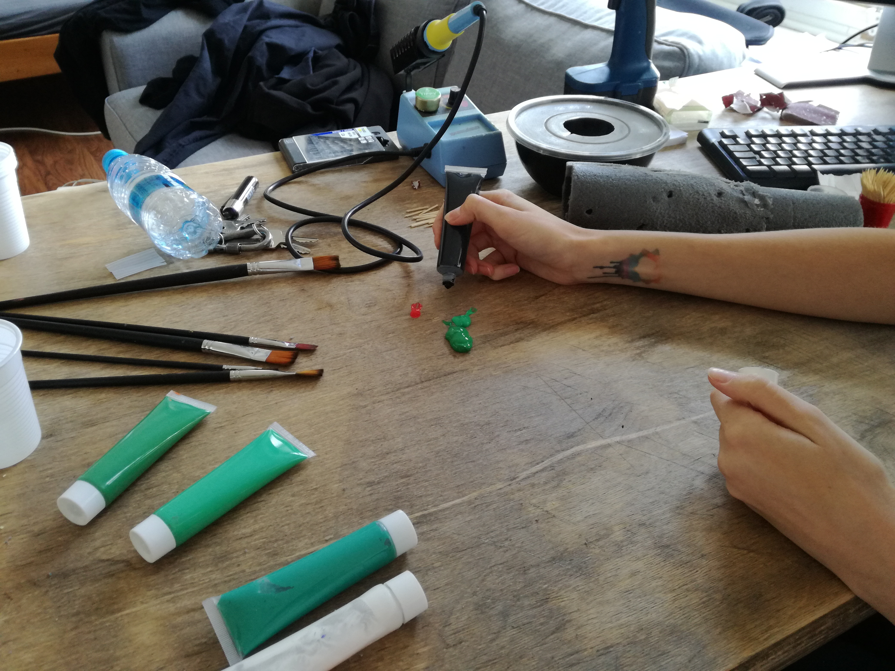

The first catctus (*Frankencactus*) turned out surprisingly well, in the sense of adding to the conzyness of the space. Despite it's technical flaws, it was appreciated by visitors and flatmates. Success!

Since the motivation for building another cactus was high, I wanted to become diffuser-independentTM. Let me explain. The diffuser caps were limited, since they were scavenged from some old christmas lights and I could not find anything similar on the internet. Weighting between different LED diffusion options, like 3D printing, paper and others, the idea of casting/molding seemed the most fun.

## Silicone mold

There's a nice overview of silicone mold-making techniques by Steve McDonald in this [video](https://www.youtube.com/watch?v=lZeQNih7MuI). Using an ordinary silicone and soaped water, I formed a ball and pressed the original diffuser in it (with it's neck sticking out). The mold dried out quickly (approx. 20mins) and was ready to be filled with hot glue. It worked out well after few failed attempts. 

> LEARNED THE HARD WAY:
>
> - sillicone smells like vinegar, but on steroids. It burns your nose and makes your room disgusting.
> - it sticks to your hands and it takes forever to get rid of it. Tip to self: use gloves!
> - don't get it on your clothes! Picture X shows my hoodie, after beingwashed two times. Yep, that was embarrasing to explain to my flatmates....

The mold was dried quickly (approx. 15-20 mins) and seemed pretty good in hand. Rubbery feeling, not super squishy but enough to get the original out. With Vita, we used the hole to stick the glue gun inside and pour glue until it started coming out. After it dried down (20min) we cut the mold horizontally and squeezed the original diffuser out. In order to fit an LED inside, a hole was drilled into the neck (X mm). Here are some results:

{: class="wider"}

It took some attempts to get it right, mostly due to awkward glue gun and no constant inflow (I guess). However, it turned out pretty good eventually, it felt like real plastic in feeling. We aligned multiple of them in a row and made a new mold. One of the questions was whether to slice it on the top (where the necks are) or at the bottom. I did it in the bottom for some reason, but it turned out to be a bad idea since the silicone was escaping on the bottom while pouring it in. Slicing the mold on the top would probably be better.

Any alternative ideas on diffuser cap making? 

